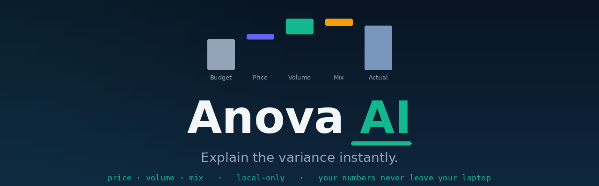

<p align="center">
  
</p>

<h1 align="center">Anova AI</h1>

<p align="center"><em>Explain the variance instantly.</em></p>

<p align="center">
  <a href="https://github.com/Lekha-Reddy-git-hub/anova/stargazers"></a>
  
  
  
</p>

<p align="center"><sub><a href="#what-it-does">What it does</a> · <a href="#price--volume--mix">PVM</a> · <a href="#privacy">Privacy</a> · <a href="#run-it">Run</a> · <a href="#faq">FAQ</a></sub></p>

An FP&A variance analyzer. Drop in budget vs actuals and it tells you what moved and
why, so nobody loses four hours in Excel hunting for a single number. Analysts spend
the majority of close week gathering data instead of explaining it. Anova does the
explaining.

## What it does

- **Price / Volume / Mix decomposition.** The headline feature. It splits a revenue
  variance into the three drivers analysts are actually paid to separate, and shows
  the bridge. See below.
- **Customizable canvas.** Drag blocks to reorder, toggle what you want on or off.
  Build the exact view you use every month.
- **The full FP&A kit as blocks.** KPI dashboard, executive summary (AI narrative),
  budget-to-actual waterfall, top variances, variance-by-category, and a variance
  table with star, status, owner, and notes per line.
- **Filters and thresholds.** Search, filter by dimension, and flag significance by
  your own percent and dollar cutoffs.
- **Import your way.** CSV, paste, or a screenshot of a budget table (AI vision).
- **AI chat.** Ask questions about your numbers in plain language.
- **Export.** Download the analysis, including your annotations.

## Price / Volume / Mix

Saying "revenue missed budget by 12 percent" is the question, not the answer. PVM
splits that gap into three drivers:

- **Price**: did you charge more or less per unit than plan.
- **Volume**: did total units move.
- **Mix**: did the blend shift toward higher or lower priced products.

The three reconcile exactly to the total variance, so a headline number becomes a
story a CFO can act on: a volume beat given back through discounting and an
unfavorable mix, for example, rather than a vague miss.

## Privacy

**Local-only, bring your own key.** Your budget file is parsed in the browser and
never leaves your machine. The AI features (summary, chat, screenshot import) call
the model directly with a key you paste, stored only in your browser. Nothing is
uploaded to any server. For a finance team handling confidential actuals, that is
often the deciding factor.

## Run it

```bash
git clone https://github.com/Lekha-Reddy-git-hub/anova.git
cd anova
npm install
npm run dev
```

Or open the standalone `index.html` build directly in a browser. No backend to set up.

## FAQ

**Do my numbers leave my computer?** No. The file is processed in your browser. Only
the AI text features make a call, and that goes straight to your chosen model with
your own key.

**What columns do I need?** A category, a budget, and an actual. Add budget-units and
actual-units columns to unlock the Price / Volume / Mix breakdown.

**Does it replace a full FP&A platform?** No, and it does not try to. It is the fast,
private tool for the one job analysts dread doing by hand: explaining why a number
moved.

**Can I customize it per company?** Yes. Map your own columns and dimensions and set
your own significance thresholds. You give it the knobs; it does not guess.
